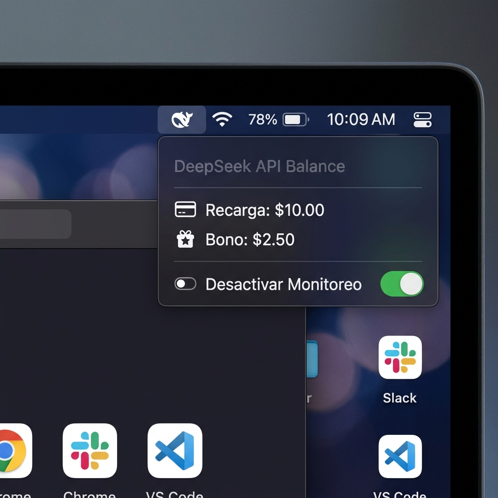

# DeepSeek Balance for SwiftBar 🤖💰

A lightweight, zero-dependency macOS menu bar plugin for SwiftBar to monitor your DeepSeek API usage in real-time.



## Features
- **Real-time Balance**: Displays your current balance directly in the macOS menu bar.
- **Toggle Control**: Pause/Resume monitoring with a single click to save API calls or for privacy.
- **Zero Dependencies**: Uses native macOS tools (`curl`, `grep`, `sed`). No `jq` or Python required.
- **Auto-Refresh**: Configured to update every 5 minutes by default.

## Installation

### 1. Requirements
- [SwiftBar](https://github.com/swiftbar/SwiftBar) installed on your macOS.
- A DeepSeek API Key.

### 2. Quick Install (CLI)
Run these commands in your terminal to download and set up the script:

```bash
# 1. Create a directory for your plugins if you don't have one
mkdir -p ~/SwiftBarPlugins

# 2. Download the script
curl -L https://raw.githubusercontent.com/YOUR_USERNAME/deepseek-swiftbar/main/deepseek_balance.5m.sh -o ~/SwiftBarPlugins/deepseek_balance.5m.sh

# 3. Make it executable
chmod +x ~/SwiftBarPlugins/deepseek_balance.5m.sh
```

### 3. Configuration
Open the file and replace `TU_API_KEY_AQUI` with your real DeepSeek API Key:

```bash
nano ~/SwiftBarPlugins/deepseek_balance.5m.sh
```

## How to use
Once the script is in your SwiftBar plugins folder:
1. **Balance Display**: You will see `DS: $X.XX USD` in your menu bar.
2. **Menu Options**:
   - **Pausar Monitoreo**: Stops API calls and shows a ⏸️ icon.
   - **Activar Monitoreo**: Resumes balance fetching.
   - **Details**: View topped-up vs granted balance.

## License
MIT
